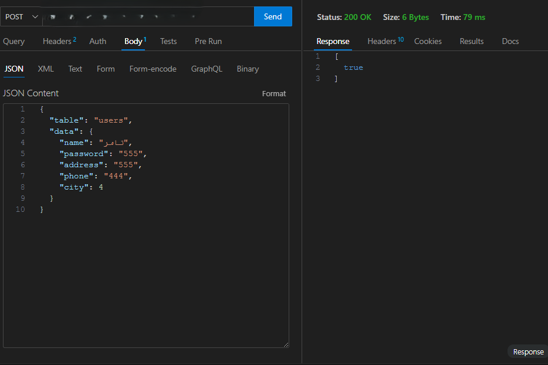

## PHP API: Authentication & CRUD Usage Guide

This API provides authentication (JWT-based) and CRUD operations for a MySQL database. Below are usage instructions and example requests for each endpoint.

---

## Authentication

### Signup
**Endpoint:** `POST /auth/signup.php`

**Body:**
```json
{
	"user": "username",
	"password": "yourpassword"
}
```
**Response:**
```
{
	"error": 0,
	"msg": "Account created",
	"res": true
}
```

### Signin (Login)
**Endpoint:** `POST /auth/signin.php`

**Body:**
```json
{
	"user": "username",
	"password": "yourpassword"
}
```
**Response:**
```
{
	"msg": 200,
	"token": "<JWT_TOKEN>",
	"res": { ...userData }
}
```

Use the returned `token` as a Bearer token for protected endpoints.

### Token-Protected Example
**Endpoint:** `POST /auth/index.php`

**Headers:**
```
Authorization: Bearer <JWT_TOKEN>
```
**Body:**
```json
{
	"name": "username",
	"password": "yourpassword"
}
```
**Response:**
```
{
	"msg": "Authenticated",
	"user": { ... }
}
```

---

## CRUD API

All CRUD endpoints expect JSON POST bodies. Replace `<table>` with your table name and adjust fields as needed.

### Select (Read)
**Endpoint:** `POST /crud/select/index.php`

**Body (by id):**
```json
{
	"table": "users",
	"id": 1
}
```
**Body (with where):**
```json
{
	"table": "users",
	"where": "age > 18"
}
```
**Response:**
```
{
	"msg": "ok",
	"res": [ ... ]
}
```

### Insert (Create)
**Endpoint:** `POST /crud/insert/index.php`

**Body (single row):**
```json
{
	"table": "users",
	"data": { "user": "john", "password": "pass" }
}
```
**Body (multiple rows):**
```json
{
	"table": "users",
	"data": [ { "user": "john" }, { "user": "jane" } ]
}
```
**Response:**
```
{
	"msg": "ok",
	"insert_id": 2,
	"res": true
}
```

### Update
**Endpoint:** `POST /crud/update/index.php`

**Body (by id):**
```json
{
	"table": "users",
	"id": 1,
	"data": { "user": "newname" }
}
```
**Body (multiple rows):**
```json
{
	"table": "users",
	"data": [ { "id": 1, "user": "a" }, { "id": 2, "user": "b" } ]
}
```
**Response:**
```
{
	"msg": "ok",
	"res": true
}
```

### Delete
**Endpoint:** `POST /crud/delete/index.php`

**Body:**
```json
{
	"table": "users",
	"id": 1
}
```
**Response:**
```
{
	"msg": "ok",
	"deleted": true
}
```

### Custom Query
**Endpoint:** `POST /crud/query/index.php`

**Body:**
```json
{
	"query": "SELECT * FROM users WHERE age > 18"
}
```
**Response:**
```
{
	"msg": "ok",
	"res": [ ... ]
}
```

---

## Notes
- All endpoints return JSON.
- For authentication, use the JWT token in the `Authorization` header as `Bearer <token>`.
- Adjust table/field names as per your database schema.

## SCREENSHOTS

